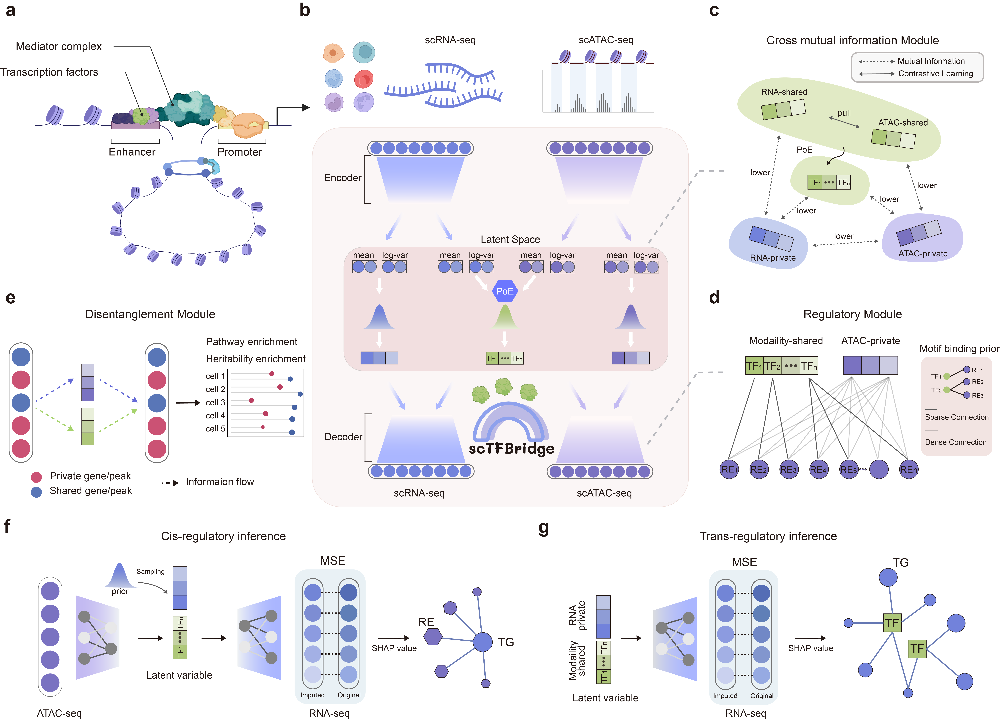

# scTFBridge

**scTFBridge: A Disentangled Deep Generative Model Informed by TF-Motif Binding for Gene Regulation Inference in Single-Cell Multi-Omics**

scTFBridge is a novel single-cell multi-omics integration method designed for modality disentanglement and gene regulatory network (GRN) inference. It leverages transcription factor (TF)-motif binding information to model complex regulatory relationships in single-cell data, enabling researchers to uncover insights into gene regulation across multiple omics layers.

 <!

## Table of Contents
- [Installation](#installation)
- [Data Preparation](#data-preparation)
- [Training and GRN inference](#training-and-grn-inference)
- [Tutorials](#tutorials)
---

## Installation

### Prerequisites

- Python 3.9 or higher
- CUDA (optional, for GPU acceleration)
- Required libraries:
  - `torch >= 1.10.0`
  - `numpy`
  - `pandas`
  - `scanpy`
  - `anndata`
  - `scipy`

### Install from source
To install scTFBridge from source, follow these steps:
```bash
# Clone the repository
git clone https://github.com/your-username/scTFBridge.git

# install with pip
Note: PyPI package coming soon. Stay tuned for updates

```


## Data Preparation
Here, we provide a demo to preprocess and train scTFBridge using a single-cell multi-omics dataset. The rheumatoid arthritis multi-omics dataset used in this demo is publicly available on the GEO database under accession code GSE243917.
### Dataset filtering
```bash
from utils.data_processing import five_fold_split_dataset, adata_multiomics_processing
import anndata


dataset = 'GSE243917'
rna_adata = anndata.read_h5ad(f'filter_data/{dataset}/GSE243917_genesXcells_ALL_batch.h5ad')
atac_data = anndata.read_h5ad(f'filter_data/{dataset}/GSE243917_peaksXcells_ALL_batch.h5ad')

TF_name = '../data/GRN/data_bulk/TFName.txt'
TF_name = open(TF_name, 'r').readlines()
for i in range(len(TF_name)):
    TF_name[i] = TF_name[i].replace('\n', '')

# adata = sc.concat((rna_adata, atac_data), axis=0)
# print(adata.var.columns)
TF_list = ['RUNX1', 'STAT1', 'IRF1', 'CTCF', 'REST', 'SPl1']
adata_multiomics_processing([rna_adata, atac_data],
                            [f'filter_data/{dataset}/RNA_filter.h5ad',
                             f'filter_data/{dataset}/ATAC_filter.h5ad',
                             f'filter_data/{dataset}/TF_filter.h5ad',
                             f'filter_data/{dataset}/batch_info.csv'],
                            2000, 0.01, TF_name, TF_list)

rna_adata = anndata.read_h5ad(f'filter_data/{dataset}/RNA_filter.h5ad')
five_fold_split_dataset(rna_adata, f'filter_data/{dataset}/fold_split_info.csv')
```
### Prepare TF-Motif Binding file
```bash
dataset_name = 'GSE243917'
#
atac_data = anndata.read_h5ad(f'filter_data/{dataset_name}/ATAC_filter.h5ad')
TF_data = anndata.read_h5ad(f'filter_data/{dataset_name}/TF_filter.h5ad')

Element_name = atac_data.var.index

pd.DataFrame(Element_name).to_csv('Peaks.txt',header=None,index=None)

GRNdir = 'GRN/data_bulk/'

Match2 = pd.read_csv(GRNdir + 'Match2.txt', sep='\t')
Match2 = Match2.values

motifWeight = pd.read_csv(GRNdir + 'motifWeight.txt', index_col=0, sep='\t')

TFName = TF_data.var.index.values

outdir = f'./{dataset_name}_TF_Binding/'

extract_overlap_regions('hg38', GRNdir, outdir, 'LINGER')
load_TFbinding(GRNdir, motifWeight, Match2, TFName, Element_name, outdir)
```

## Training and GRN inference

### loading GEX ATAC adata
```bash
dataset_name = 'GSE243917'
gex_data = anndata.read_h5ad(f'../data/filter_data/{dataset_name}/RNA_filter.h5ad')
atac_adata = anndata.read_h5ad(f'../data/filter_data/{dataset_name}/ATAC_filter.h5ad')
TF_adata = anndata.read_h5ad(f'../data/filter_data/{dataset_name}/TF_filter.h5ad')

TF_length = TF_adata.var.shape[0]

fold_split_info = pd.read_csv(f'../data/filter_data/{dataset_name}/fold_split_info.csv')
mask = pd.read_csv(f'../data/{dataset_name}_TF_Binding/TF_binding.txt', sep='\t', header=None).values
```

### loading scTFBridge
```bash
mask_tensor = torch.tensor(mask).float()
scTFBridge_demo = scMulti([dim1, dim2], [1024], [1024], TF_dim, 1, ['gaussian', 'bernoulli'], batch_dims, 1, mask_tensor)
```
The training process can be found in train/train_demo.py, then you will get the trained model for GRN inference.


### GRN inference
construct explain model
```bash
from model.scTFBridge import scMulti, explainModelLatentZ

sc_multi_demo = scMulti([dim1, dim2], [1024], [1024],
                        128, 1, ['gaussian', 'bernoulli'], batch_dims, 1, mask_tensor)
model_dict = torch.load(f'model_dict/sc_multi_{dataset_name}_fold{fold}.pt', map_location='cpu')
sc_multi_demo.load_state_dict(model_dict)
sc_multi_demo.cuda()
sc_multi_demo.eval()
sc_multi_demo.latent_mode = 'latent_z'

explain_model = explainModelLatentZ(sc_multi_demo, 'rna', 128, 0)
explain_model.eval()
explain_model.cuda()
```
The more details can be found at train/explain_TF.py
## Tutorials
Tutorials will be available soon.


